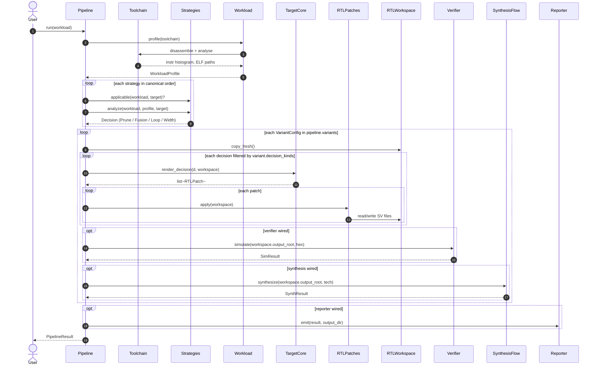

# ARVIS Portability Architecture

This document describes the portability layer introduced on the
`portability` branch: a strategy-pluggable, target-agnostic
specialization pipeline for RISC-V cores. It is intended for
academic reviewers and contributors who need to understand the
design without reading every file.

## 1. Goals

The portability layer was added to address three concerns in the
original ARVIS code:

1. **Strategy lock-in.** Pruning was hard-coded to a usage-driven
   analysis; fusion was hard-coded to n-gram mining; hwloop was
   hard-coded to a PULP-style detector. Researchers could not A/B
   compare alternative strategies (e.g. cycle-driven pruning,
   profile-guided fusion) without modifying core code.
2. **Target lock-in.** Every step assumed cv32e40p RTL conventions,
   parameter names, encoding spaces, and testbench shape. Porting
   to a sibling core (ibex, Kelvin) required editing pipeline
   internals.
3. **Implicit state.** A single `PipelineContext` god-object
   accumulated ~40 attributes ad-hoc; phases communicated by
   reading and writing context fields. This made dataflow opaque
   and broke under composition.

The portability refactor introduces a small layer of typed
abstractions that **describe** rather than **prescribe** the work.
Concrete strategies, targets, toolchains, verifiers, synthesis
flows, and reporters all plug into a single `Pipeline` orchestrator.

## 2. Public surface

The `core/` package exports the abstract types. Concrete
implementations live alongside in `targets/`, `strategies/`, etc.

```
core/
├── isa.py           ISADescriptor (RV32IMC_Zicsr presets, cflags)
├── strategy.py      OptimizationStrategy[D] + 4 sub-abstracts +
│                    4 Decision dataclasses
├── target.py        TargetCore + CoreParameter + OpcodeSpace + OpcodeSlot
├── rtl_patch.py     RTLPatch hierarchy + RTLWorkspace
├── toolchain.py     Toolchain + CompiledArtifact
├── verifier.py      Verifier + SimResult
├── synthesis.py     SynthesisFlow + SynthResult
├── reporter.py      Reporter
├── workload.py      Workload + WorkloadProfile + WorkloadSuite +
│                    BuildRecipe + ExpectedResult
└── pipeline.py      Pipeline + PipelineResult + VariantResult +
                     VariantConfig
```

## 3. Class diagram

```mermaid
classDiagram
    %% ── Top-level orchestration ─────────────────────────────────
    class Pipeline {
        +target: TargetCore
        +toolchain: Toolchain
        +strategies: list~OptimizationStrategy~
        +verifier: Verifier
        +synthesis: SynthesisFlow
        +reporter: Reporter
        +variants: list~VariantConfig~
        +run(workload: Workload) PipelineResult
    }
    class PipelineResult {
        +decisions: dict
        +variants: list~VariantResult~
    }
    class VariantConfig {
        +label: str
        +decision_kinds: frozenset~str~
        +hex_source: str
        +includes(name) bool
    }

    %% ── Strategy hierarchy (Strategy + Generic) ─────────────────
    class OptimizationStrategy~D~ {
        <<abstract>>
        +name: str
        +applicable(workload, target) bool
        +analyze(workload, profile, target) D
    }
    class Decision {
        <<abstract>>
        +render(target) list~RTLPatch~
    }
    class PruningStrategy
    class FusionStrategy
    class LoopStrategy
    class WidthStrategy
    OptimizationStrategy <|-- PruningStrategy
    OptimizationStrategy <|-- FusionStrategy
    OptimizationStrategy <|-- LoopStrategy
    OptimizationStrategy <|-- WidthStrategy

    class PruneDecision
    class FusionDecision
    class LoopDecision
    class WidthDecision
    Decision <|-- PruneDecision
    Decision <|-- FusionDecision
    Decision <|-- LoopDecision
    Decision <|-- WidthDecision

    PruningStrategy ..> PruneDecision : produces
    FusionStrategy  ..> FusionDecision : produces
    LoopStrategy    ..> LoopDecision : produces
    WidthStrategy   ..> WidthDecision : produces

    %% ── Target abstraction ─────────────────────────────────────
    class TargetCore {
        <<abstract>>
        +name: str
        +isa: ISADescriptor
        +rtl_root: Path
        +parameters() list~CoreParameter~
        +opcode_space() OpcodeSpace
        +reset_vector: int
        +memory_layout: dict
        +testbench_dir() Path
        +render_decision(d, ws) list~RTLPatch~
    }
    class CV32E40P
    TargetCore <|-- CV32E40P

    class CoreParameter {
        +name: str
        +default: int
        +minimum: int
        +maximum: int
        +clamp(value) int
    }
    class OpcodeSpace {
        +available: list~OpcodeSlot~
        +allocate() OpcodeSlot
        +free_slots() int
    }
    TargetCore o-- CoreParameter
    TargetCore o-- OpcodeSpace

    %% ── RTL emission ───────────────────────────────────────────
    class RTLPatch {
        <<abstract>>
        +label: str
        +apply(workspace)
    }
    class RTLWorkspace {
        +source_root: Path
        +output_root: Path
        +copy_fresh()
        +read(rel) str
        +write(rel, content)
    }
    class WidthNarrowingPatch
    class PrunePatch
    class FusionPatch
    class LoopPatch
    RTLPatch <|-- WidthNarrowingPatch
    RTLPatch <|-- PrunePatch
    RTLPatch <|-- FusionPatch
    RTLPatch <|-- LoopPatch
    RTLPatch ..> RTLWorkspace : mutates

    %% ── Workload + Toolchain + Verifier + Synthesis ────────────
    class Workload {
        <<abstract>>
        +name: str
        +sources: list~Path~
        +cflags: list~str~
        +profile(toolchain) WorkloadProfile
    }
    class WorkloadProfile {
        +instr_histogram: dict
        +cycle_profile: dict
        +loops: tuple
        +elf_paths: tuple
    }
    class Toolchain {
        <<abstract>>
        +compile(workload, cflags) CompiledArtifact
        +disassemble(elf) str
        +register_custom_ops(decision)
    }
    class Verifier {
        <<abstract>>
        +simulate(rtl_dir, hex) SimResult
    }
    class SynthesisFlow {
        <<abstract>>
        +synthesize(rtl_dir, tech) SynthResult
    }

    Pipeline o-- TargetCore
    Pipeline o-- Toolchain
    Pipeline o-- OptimizationStrategy
    Pipeline o-- Verifier
    Pipeline o-- SynthesisFlow
    Pipeline o-- VariantConfig
    Pipeline ..> Workload : run(workload)
    Workload ..> WorkloadProfile : profile()
```



## 4. End-to-end sequence

A single `Pipeline.run(workload)` invocation with N variants:



## 5. Design patterns used

| Pattern | Where | What it solves |
|---|---|---|
| **Strategy** | `OptimizationStrategy[D]` + sub-abstracts | Swappable analysis algorithms (n-gram fusion vs profile-guided fusion vs manual). |
| **Generic typing** | `OptimizationStrategy[D]` parametrised on the Decision type | Compile-time guarantee that a `PruningStrategy` returns a `PruneDecision`, not a `FusionDecision`. |
| **Value object** | `Decision` subclasses (frozen `@dataclass`) | Immutability; safe to share across phases; Python-pickleable for caching. |
| **Visitor (light)** | `TargetCore.render_decision` dispatches by `Decision` type | New decision types extend `render_decision` by overriding the corresponding `render_<kind>_decision` method on the target. |
| **Composite** | `RTLPatch.CompositePatch` | Group related edits under a single label without breaking idempotency. |
| **Template method** | `Pipeline.run()` skeleton with overridable `_strategy_order_key` | Pipelines may reorder strategies (e.g. for an experimental schedule) by subclassing. |
| **Builder** | `Pipeline(target=..., strategies=[...], variants=[...])` | Explicit composition of the pipeline; no global registry to mutate. |
| **Specification** | `VariantConfig.decision_kinds` filter at emission time | A variant is described as the set of decision types it includes; orthogonal to the strategy order. |

## 6. Patch ordering and dependencies

When a variant is emitted, its decisions are rendered into patches.
Patches are applied in a fixed canonical order:

1. **Prune** — strips datapaths the specialised decoder no longer
   needs (ALU ops, multiplier modes, opcode groups).
2. **Fusion** — adds new decoder cases on the surviving (post-prune)
   ALU/decoder.
3. **Loop** — operates on the post-fusion decoder
   (hwloop pragma processor + `cv32e40p_hwloop_regs.sv` template
   swap when `nest_depth > 0`).
4. **Width** — final parameter rewrites (`PC_WIDTH`,
   `HWLP_ADDR_WIDTH`, `CNT_WIDTH`).

This ordering matches the legacy `RTLChangeSet.apply` so the new
path is byte-identical to the old when given the same decisions
(verified for the `PRUNED` variant — see
`examples/portability_equivalence.py`).

## 7. Decision lifecycle

A decision has three phases of life:

```
strategy.analyze ─→ Decision ─→ target.render_decision ─→ list~RTLPatch~
   (analysis)        (typed)        (lowering)              (mutation)
```

- **Analysis** runs once per `Pipeline.run()`, producing one
  Decision per applicable strategy.
- **Lowering** runs once per (variant, decision) pair; the same
  Decision may be lowered into different patches in different
  variants (e.g. a `PruneDecision` is a no-op in the `BASELINE`
  variant but produces an `RTLPruner` patch in the `PRUNED`
  variant).
- **Mutation** runs once per patch when the variant emission
  applies it.

Decisions are immutable; patches operate on a workspace that's
freshly copied from the target's `rtl_root` per variant. There is
no shared mutable state between variants.

## 8. Decision data model (typed fields, no opaque bridge)

The four decision dataclasses (`PruneDecision`, `FusionDecision`,
`LoopDecision`, `WidthDecision`) carry exclusively **typed**
fields. Earlier drafts of the migration used an `Optional[Any]`
`target_payload` slot to ferry legacy data through the strategy
→ patch boundary; that bridge is closed.

`PruneDecision` in particular carries the full set of fields the
cv32e40p emitter needs:

- `removable_alu_ops: FrozenSet[str]`
- `removable_mul_modes: FrozenSet[str]`
- `removable_opcode_groups: FrozenSet[str]`
- `feature_flags: Dict[str, bool]` — every `enable_*` toggle
- `used_instructions: FrozenSet[str]`
- `unused_registers: Tuple[int, ...]`
- `used_regs_mask: int`
- `removable_csr_labels: FrozenSet[str]`
- `removable_csr_storage: FrozenSet[str]`
- `target_overlay: Dict[str, int]` — target capability counts
  (`corev_pulp`, `fpu`, `num_mhpmcounters`, etc.) the strategy
  observed and propagates

Translation between the legacy `PruneConfig` (mutable, attribute-
heavy) and the new `PruneDecision` (frozen, typed) is performed
in two symmetric places:

- `strategies.pruning.usage_driven.UsageDrivenPruner._translate`
  — `PruneConfig` → `PruneDecision`.
- `targets.cv32e40p.patches.PrunePatch._build_prune_config`
  — `PruneDecision` → `PruneConfig`.

The pair is round-trip-lossless versus the legacy
`compute_prune_config` output. Equivalence is verified by
`examples/portability_equivalence.py`: all 174 SV files in the
PRUNED variant's RTL workspace are byte-identical between the
legacy `RTLPruner` path and the new `Pipeline.run()` path.

## 9. Equivalence-test discipline

`examples/portability_equivalence.py` is the regression-discipline
guard for the migration. It:

1. Constructs a `PruneDecision` via the live strategy.
2. Applies it via the legacy `RTLPruner` to one workspace.
3. Applies it via the new `Pipeline.run()` to another workspace.
4. Hashes every `.sv` file in both trees and reports diffs.

A green run means the new path is a verified drop-in for the
legacy path on the variant under test. The repository
guarantees the test passes for the `PRUNED` variant on the `ud`
benchmark (174 SV files byte-identical).

`FUSED_PRUNED`, `HWLOOP_PRUNED`, and `ALL` coverage is in flight
(see `docs/portability.md` § Limitations).

## 10. Migration phases

The portability layer was introduced incrementally:

| Phase | Commits | What landed |
|---|---|---|
| **1.1–1.7** | `daf82a9..83697d8` | `core/` abstractions; concrete strategies and target; `Pipeline.run()` in decisions-only mode. |
| **2.1–2.4** | `8d6b3e2..0820409` | Real `RTLPatch` implementations for each Decision type. |
| **2.5–2.7** | `5d32664..1af0adb` | Standard variant configs; per-variant emission; equivalence test for `PRUNED`. |
| **2.7b** | `28d72a2` | Equivalence test extended to all 5 variants (residual diffs: 0/2/2/4/4). |
| **2.7c** | `e7f6551` | Three load-bearing fixes drove residual diffs to **0/0/0/0/0** byte-identical. |
| **3** | committed | Doc, test suite, typed-field migration (target_payload removed), partial codegen factoring. |
| **2.8** | `cc33db3` | `--use-portability` flag wires `RTLChangeSet.apply` to the portable path; gateway smoke shows byte-equivalence on all 4 cs.apply variants. |
| **3.2 + 3.3** | `7456fad` | All 12 ``RTLChangeSet._apply_*`` private methods promoted to pure free functions in ``targets/cv32e40p/passes.py`` -- the target package is now self-contained. |
| **4.1 - 4.5** | `5f8eb8b..dd126cb` | Industry-standard hardening: pre-commit hooks (ruff/ruff-format/mypy/codespell), structured logging via ``core/logging_config``, Pydantic v2 ``BaseModel`` for the Decision hierarchy, ``mypy --strict`` clean across 32 source files, **>=90% test coverage** enforced in CI. |
| **5.1 - 5.7** | next | Generalised hyperparameter-sweep framework (``core/sweep.py``) with 4 search strategies (Grid/Random/Bayesian/Halving) over multi-parameter spaces.  Existing FIFO + HW_LOOP sweeps become 30-line subclasses.  See ``docs/sweep.md``. |
| **5b** | `4144752` | HW_LOOP sweep selection routed through ``HWLoopDepthSweep``.  ``pick_best`` replaced by ``_select_hwloop_winners`` + ``_print_hwloop_sweep_table`` helpers. |
| **6** | this | ``--use-pipeline-runner`` gateway routes the HW_LOOP sweep's per-candidate sim+synth through ``Pipeline._emit_variant`` + ``VerilatorVerifier`` + ``YosysSynthesisFlow``.  See ``docs/runner-replacement.md``. |

### Phase 2.8: the portability gateway

The active production path is still the legacy
`RTLChangeSet.apply` body.  Phase 2.8 introduces an opt-in
gateway: when the user passes `--use-portability` (or sets
`ARVIS_USE_PORTABILITY=1`), `apply()` routes through
`targets/cv32e40p/portability_shim.emit_via_portability` instead
of running its own emission code.

The shim is a thin translator:

1. **Translate** the changeset's untyped state
   (`prune_config`, `fused_operations`, `hw_loop_count`,
   `pc_width`, `prefetch_fifo_depth`, ...) into typed
   `Decision` instances.
2. **Synthesise** a `VariantConfig` from the set of non-trivial
   decisions present (no hardcoded variant taxonomy: any subset
   the changeset describes is emittable).
3. **Emit** by setting up an `RTLWorkspace` rooted at
   `ctx.rtl_output_dir` and running
   `target.allocate_workspace_metadata` + the canonical patch
   sequence (`PruneDecision` → `FusionDecision` →
   `LoopDecision` → `WidthDecision`).

`ctx.rtl_output_dir` is mutated in the same way the legacy
path does (writes to `cfg.output_dir/rtl_<label>/`), so the
runner's downstream code is completely unaffected by the
choice of path.

**Verification.**  `examples/portability_gateway_smoke.py`
exercises the dispatch site directly.  It builds an
`RTLChangeSet` for each of the four `cs.apply` variants
(PRUNED, FUSED_PRUNED, HWLOOP_PRUNED, ALL) and emits twice --
once with `cfg.use_portability=False` (legacy) and once with
`True` (gateway).  Result on the `ud` benchmark:

```
✓ [pruned       ] legacy=120 files, portab=120 files, diffs=0
✓ [fused_pruned ] legacy=120 files, portab=120 files, diffs=0
✓ [hwloop_pruned] legacy=120 files, portab=120 files, diffs=0
✓ [all          ] legacy=120 files, portab=120 files, diffs=0

✓ Gateway path BYTE-EQUIVALENT to legacy on all 4 cs.apply variants
```

**Why opt-in.**  The 21-benchmark sweep uses a number of
runner-level features (Docker GCC builds, hwloop sweeps,
exhaustive HW selection) whose interaction with the new path
hasn't been exhaustively re-validated end-to-end.  The
gateway preserves every existing user's bit-for-bit output
by default; researchers who want to try the portable path
opt in explicitly.

Each commit is independently buildable and the legacy pipeline
remains the active path; `--use-portability` is the documented
escape hatch into the new architecture.

## 11. Code organisation: passes vs patches vs strategies

After Phase 3.2/3.3 the cv32e40p target package is laid out as
three concentric layers, each with a clear responsibility.

```
strategies/                      (target-AGNOSTIC analysis)
   ↓ produces
core/strategy.py: Decision       (typed analysis result)
   ↓ rendered into
targets/cv32e40p/patches.py      (target-SPECIFIC orchestration)
   ↓ which call
targets/cv32e40p/passes.py       (target-SPECIFIC primitive ops)
   ↓ which delegate to
codegen/rtl/                     (low-level RTL manipulation lib)
```

| Layer | Lives in | Responsibility | Talks to |
|---|---|---|---|
| **Strategies** | `strategies/` | Pure analysis: read a workload + a target, return a typed `Decision`.  No RTL mutation. | `Workload`, `TargetCore` (read-only) |
| **Decisions** | `core/strategy.py` | Plain dataclasses.  YAML-friendly.  No methods that mutate state. | – |
| **Patches** | `targets/cv32e40p/patches.py` | Translate one `Decision` into a sequence of RTL mutations on an `RTLWorkspace`.  Orchestrate ordering. | Passes; `RTLWorkspace`; `workspace.metadata` |
| **Passes** | `targets/cv32e40p/passes.py` | Pure free functions, each performing one well-named pass on the workspace (e.g. `apply_hwloop_pragmas`). | `codegen/rtl/`; `RTLWorkspace` |
| **Codegen library** | `codegen/rtl/` | Low-level pragma processing, decoder generation, DCE.  Target-aware (file paths) but reusable across cv32e40p forks. | Filesystem |

Why this split matters
----------------------

* **Strategies are testable in isolation.**  No filesystem, no
  workspace; just a workload and a target descriptor.
* **Decisions are serialisable.**  A workload's analysis output
  can be cached as a pickle/YAML file and replayed on a
  re-emission without rerunning the strategies.
* **Patches encode "what" not "how".**  When we ship the cv32e40p
  target out of the repo, all the orchestration is in one
  package.  No reaching back into `RTLChangeSet` private methods.
* **Passes are the unit of reuse.**  Every legacy `cs._apply_*`
  method is now a free function that takes only its actual
  inputs.  Any caller (legacy `RTLChangeSet`, `PrunePatch`,
  `LoopPatch`, `FusionPatch`, future targets that fork
  cv32e40p) calls the pass directly with explicit kwargs.

Adding a new pass
-----------------

When you discover a new RTL transformation you need:

1. Write a free function in
   `targets/cv32e40p/passes.py` with keyword-only arguments
   for everything it reads.  Add a docstring with parameters,
   returns, and idempotency notes.
2. Add it to `__all__` and write at least one contract test
   in `tests/portability/test_passes.py` (importability,
   no-op safety, idempotency).
3. Call it from the appropriate `RTLPatch.apply` in
   `targets/cv32e40p/patches.py`.
4. If the legacy `RTLChangeSet` should also use it, add a
   thin shim in `pipeline/rtl_changeset.py` that translates
   from the changeset's untyped state.

What still lives in `codegen/rtl/`
----------------------------------

`codegen/rtl/` retains the low-level RTL manipulation primitives:

* `rtl_pragma.py`    -- generic ARVIS_FOO pragma block parser
* `hwloop_pragma.py` -- hwloop-specific pragma generators
* `pulp_pragma.py` / `irq_pragma.py` / `ctrl_pragma.py` /
  `debug_pragma.py` -- feature-specific generators
* `rtl_pruning.py`   -- decoder regen + opcode-block stripping
* `pyslang_dce.py`   -- pyslang-based dead-code elimination
* `encoding_optimizer.py` -- enum-width reduction
* `isa_fusion/`      -- fused-instruction RTL generator
* `fused_imm_patcher.py` / `adder_reuse_patcher.py` /
  `mult_reuse_patcher.py` -- post-fusion port wiring

These contain cv32e40p-specific knowledge (file paths, ALU enum
names, controller FSM state names) but are reusable across cv32e40p
forks.  A non-cv32e40p target would need to reimplement these
primitives, then write its own `passes.py` that wraps them.


## 12. Hyperparameter sweep framework

Phase 5 generalises design-space exploration into a single
:class:`SweepStrategy` framework.  See ``docs/sweep.md`` for the
tutorial; the architecture summary:

```
core/sweep.py
   ├─ SweepCandidate            one point in the design space
   ├─ SearchSpace               parameter set + candidate values
   ├─ SearchStrategy (Protocol) GridSearch | RandomSearch
   │                            | BayesianSearch | SuccessiveHalving
   ├─ SweepResult (Pydantic)    one evaluated candidate (JSON-able)
   ├─ SweepDecision (Pydantic)  winner + all results
   └─ SweepStrategy (abstract)  ties evaluator + cost + search

strategies/sweep/
   ├─ PrefetchFIFOSweep   single-parameter, FIFO_DEPTH
   ├─ HWLoopDepthSweep    single-parameter, HW_LOOP
   └─ MultiParamSweep     multi-parameter, arbitrary

targets/cv32e40p/sweep_evaluators.py
   ├─ PrefetchFIFOEvaluator   build RTL + Verilator + Yosys
   └─ HWLoopDepthEvaluator    table lookup over pre-computed metrics
```

The framework is target-agnostic; concrete evaluators live in
target packages and translate candidates into per-target work.
Each evaluator:

1. Receives a ``SweepCandidate`` (a parameter-override map).
2. Builds the per-candidate RTL + simulates + synthesises.
3. Returns a ``dict[str, float]`` containing at least
   ``passed: bool``.

The framework wraps the metrics into a ``SweepResult``, feeds the
cost back to the (adaptive) search strategy via ``tell()``, and
selects the lowest-cost passing candidate as the winner.

Why Pydantic for ``SweepResult`` / ``SweepDecision``?

* JSON round-trip is free (cache sweep results across runs).
* Cross-process replay: a worker can dump a result; the main
  process can reload it without re-running Verilator.
* Type-safe access at construction time (validators reject
  malformed metrics).

Replacing today's three ad-hoc sweeps (``pipeline/prefetch_sweep.
py``, ``pipeline/runner.py:_sweep_hwloop_candidates``,
``analyze_counter_width``) with the unified framework is the
explicit Phase 5 goal.  ``pipeline/prefetch_sweep.py`` is now a
thin shim around :class:`PrefetchFIFOSweep`; the HW_LOOP sweep
will follow once the dual-compile machinery is factored out of
``runner.py``.


## 13. Pointers

- **Add a new pruning strategy**: see `strategies/pruning/usage_driven.py`,
  subclass `PruningStrategy`, return `PruneDecision`. Compose into a
  `Pipeline` instead of `UsageDrivenPruner`. No core changes needed.
- **Add a new target core**: see `docs/portability.md` for the
  port playbook.
- **Run the equivalence test**: `python3 examples/portability_equivalence.py`.
- **Run the smoke test**: `python3 examples/portability_smoke.py`.
